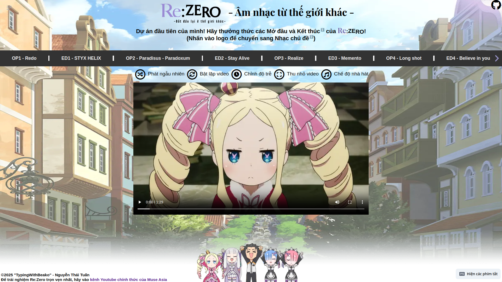

  

# 🎬 Trình phát video Mở đầu và Kết thúc của Re:Zero

  

## 📋 Tổng quan

  

Một trình phát video bản web cho các Mở đầu, Kết thúc và Nhạc chủ đề của bộ anime Re:Zero. Logic video cốt lõi được tự làm bằng HTML, CSS và JavaScript thuần túy, được tăng cường bằng các công nghệ web hiện đại để mang lại trải nghiệm mượt mà và sống động.

  

### ⚠️ Tuyên bố từ chối trách nhiệm

  

Dự án này sử dụng nội dung Re:Zero được cấp phép bởi Muse Việt Nam:

  

- Các Mở đầu

  

- Các Kết thúc (bao gồm cả Kết thúc mùa)

  

- Các Nhạc chủ đề

  

Tất cả các quyền được bảo lưu bởi chủ sở hữu bản quyền tương ứng.

  
  

Để có trải nghiệm Re:Zero toàn vẹn nhất, hãy truy cập [kênh YouTube chính thức của Muse Việt Nam](https://www.youtube.com/c/MuseVi%E1%BB%87tNam).

  

Đây là một dự án giáo dục và không được dùng để kiếm tiền.

  

### 🤔 Tại sao có dự án này?

  

Mình tạo ra dự án này để học các nguyên tắc cơ bản về phát triển web đồng thời giải quyết nhu cầu cá nhân - để dễ dàng xem các Mở đầu, Kết thúc và Nhạc chủ đề của Re:Zero. Dự án này đã giúp mình hiểu thêm về các API trên trình duyệt, quản lý state và tối ưu hóa hiệu suất.

  
  

## 🎯 Ý nghĩa Triết học của dự án

### Mối liên hệ với Re:Zero  

Dự án này được sinh ra bởi vì Re:Zero đã cứu cuộc đời của mình. Giống như Subaru, mình đã bắt đầu từ con số 0, với không một kinh nghiệm lập trình nào, dùng chỉ những công nghệ cơ bản của lập trình web. Qua hơn 416 commits xuyên suốt 5.5 tháng, dự án này mang đậm lời nhắn của Re:Zero: Bắt đầu từ con số 0 và đạt được điều không thể qua ý chí kiên cường.

### Cách tiếp cận thô sơ nhất

Dự án này cố tình sử dụng HTML, CSS và JavaScript thuần túy ở tính năng chính của nó. Giống như Subaru phải học tất cả từ con số 0, mình đã tạo dự án này bằng cách sử dụng những thứ cơ bản nhất (Thật sự là do mình không biết abstractions đm):

- Cú pháp JavaScript đơn giản

- Các phần tử HTML tự code

- Các tính năng cốt lõi của CSS

- Các API có sẵn của Trình duyệt
### Ý nghĩa thật sự của dự án

Dự án này không được tạo nên do mình cần sự công nhận hay thể hiện tài năng chuyên môn của mình. Giống như Subaru luôn chỉ quan tâm đến việc bảo vệ những người mà anh ấy quan tâm, dự án này chỉ có 1 động lực duy nhất: để xem Re:Zero một cách hoàn hảo nhất. Các tính năng về mặt chuyên môn chỉ là tác dụng phụ của ý muốn trên của mình.

### Một ý nhấn mạnh về độ phức tạp

Mặc dù dự án này vượt trội hơn nhiều giải pháp bằng framework khác, nó không được sinh ra để chứng minh framework là không cần thiết. Dự án này được tạo nên bởi các công nghệ cơ bản bởi vì đó là cách trực diện nhất mà mình thấy để đến với mục đích chính của mình: xem Re:Zero một cách hoàn hảo.

Hãy nhớ: "Hãy cùng bắt đầu từ đây, từ con số 1. Không, từ số 0!" - Rem, Re:Zero

### ⏱️ Thời gian phát triển

  

20/09/2024 - 06/03/2025 (≈ 5,5 tháng)

  

## 💻 Công nghệ cốt lõi

  

Logic trình phát video cốt lõi, chuyển đổi nội dung động và quản lý trạng thái được tự làm bằng HTML, CSS và JavaScript thuần túy.

  

> "Hãy cùng bắt đầu từ đây, từ con số một. Không,.. Từ số 0!" - Rem, Re:Zero

  

### 🛠️ Các công nghệ được sử dụng

  

- HTML

  

- CSS

  

- JavaScript (chính)

  

- Tailwind CSS

- Flowbite

  

- jQuery

  

- MicroModal

  

## ✨ Tính năng

  

- 🔄 **Chuyển đổi nội dung động:** Chuyển đổi liền mạch giữa các video Mở đầu, Kết thúc và Nhạc chủ đề.

  

- 🖼️ **Chế độ Hình trong hình:** Xem video trong khi đa nhiệm.

  

- 🎭 **Chế độ Nhà hát:** Đắm mình trong trải nghiệm xem như rạp chiếu phim.

  

- ⌨️ **Phím tắt Bàn phím:** Điều khiển trình phát video bằng các phím tắt bàn phím tiện lợi.

  

- 🎵 **Tích hợp Media Session API:** Điều khiển phát lại từ các điều khiển phương tiện của trình duyệt hoặc thiết bị của bạn.

  

- 📱 **Thiết kế Responsive:** Tận hưởng trải nghiệm nhất quán trên nhiều kích thước màn hình và thiết bị khác nhau.

  

- 🔀 **Phát ngẫu nhiên:** Xáo trộn danh sách phát video để có trải nghiệm mới mẻ.

  

- 🔁 **Lặp video:** Bật phát lại liên tục các video yêu thích của bạn.

  

- ⏱️ **Điều chỉnh độ trễ:** Tùy chỉnh độ trễ giữa các video để có trải nghiệm xem được cá nhân hóa.

  

- ⚡ **Tải trước thông minh:** Chuyển tiếp liền mạch sang video tiếp theo mà không cần phải buffer video.

  

- 📲 **Ứng dụng PWA:** Cài đặt như ứng dụng trên thiết bị và truy cập nhanh hơn vào các lần tiếp theo.

  

- 🔊 **Lưu trữ âm lượng:** Ghi nhớ cài đặt âm lượng ưa thích của bạn giữa các phiên sử dụng.

  
  

## 📸 Ảnh chụp giao diện

  
  

-  **Trang chính**

  
  

  
  

-  **Trang chính (với mô tả video)**

  
  

  
  

-  **Trang chính (với tiêu đề và các nút điều khiển từ Media Session API)**

  
  

  
  

-  **Chế độ Nhà hát**

  
  

  
  

## 🚀 Cách sử dụng

  

- Truy cập bản demo trực tiếp tại [https://typingwithbeako.github.io](https://typingwithbeako.github.io)

  

## ⌨️ Phím tắt bàn phím

  

-  `Space`: Phát/Tạm dừng

  

-  `←`/`→`: Video Trước/Tiếp theo

  

-  `↑`/`↓`: Tăng/Giảm âm lượng

  

-  `0-9`: Phát Video cụ thể (số 1 tương ứng với video đầu tiên)

  

-  `Tab`: Chuyển đổi giữa Mở đầu/Kết thúc và Nhạc chủ đề

  

-  `Q`: Phát ngẫu nhiên

  

-  `W`: Bật/Tắt Lặp video

  

-  `E`: Thay đổi Độ trễ

  

-  `R`: Bật/Tắt chế độ Hình trong hình

  

-  `F`: Bật/Tắt chế độ Toàn màn hình

  

-  `T`: Bật/Tắt chế độ Nhà hát

  

-  `D`: Phát "Theater D"

  

-  `O`: Phát "Kết thúc Mùa 1"

  

-  `P`: Phát "Kết thúc Mùa 2"

  

-  `S`: Phát "STYX HELIX (bản chậm)"

  

-  `Escape`: Thoát chế độ Nhà hát

  

-  `B`: Chuyển đổi giữa bản cắt và bản đầy đủ của "STYX HELIX"

  

## 👥 Đóng góp

  

Đóng góp được hoan nghênh! Vui lòng gửi Pull Request hoặc mở vấn đề để đề xuất cải tiến hoặc báo cáo lỗi.

  

## 📄 Giấy phép

  

MIT License

  

## 👨‍💻 Tác giả

  

Nguyễn Thái Tuấn